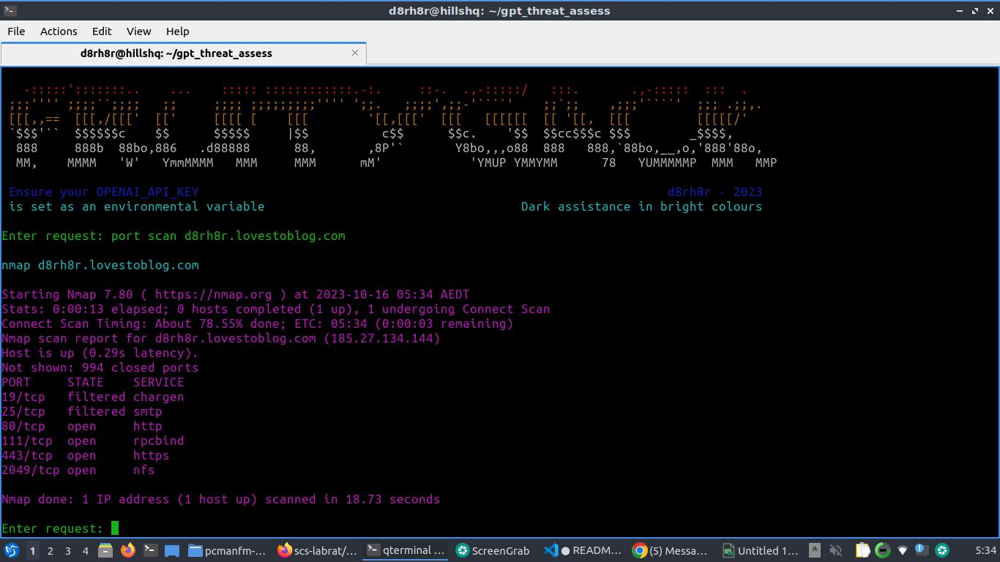

# FruityGack
## Dark assistance in bright colours :)

Massive shout out to Clint Bodungen & his course "Mastering AI for Cyber Security".  This tool is based off one of the absolutely cracker tutorials... Thanks legend..

### Install
Clone repository
Ensure OPENAI_API_KEY is set as an enviromental variable

on Linux
```export OPENAI_API_KEY='sk-09r0hwe0fhwe0f'```

on Windows
```$env:OPENAI_API_KEY = "sk-09r0hwe0fhwe0f" ```

To run
```python3 fruitygack.py```

No need to have a grasp of the command line.  You point, Fruitygack will shoot.  As long as you have the required tools installed, FG will make the magic happen... 

example...
### Request: show me info about my wifi connection
### Command: iwconfig

### Request: scan local host for vulnerabilies
### Command: nmap -sV localhost

### Request: what is the ip range for palestine?
### Command: whois -h whois.ripe.net '-i origin AS29259' | grep -Eo '([0-9.]+){4}/[0-9]+'
